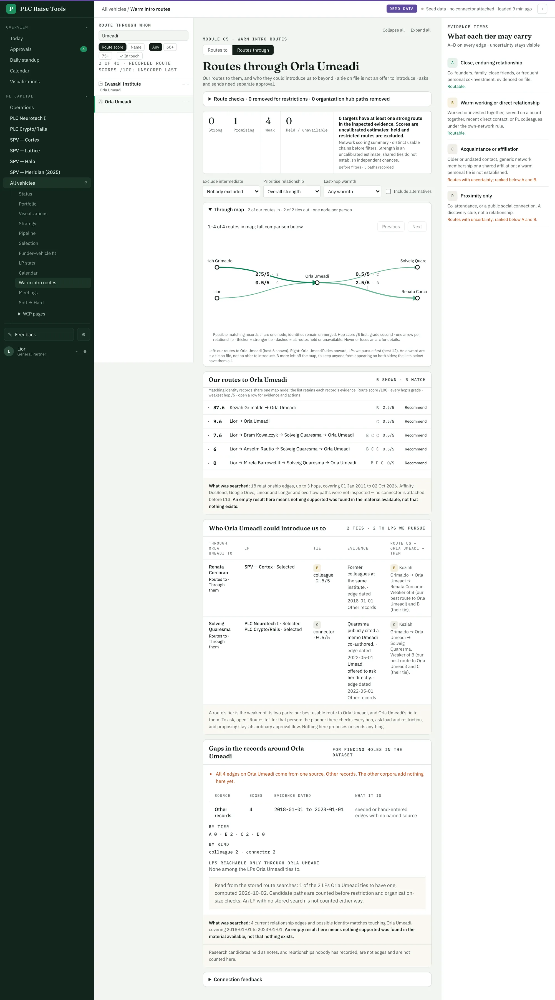
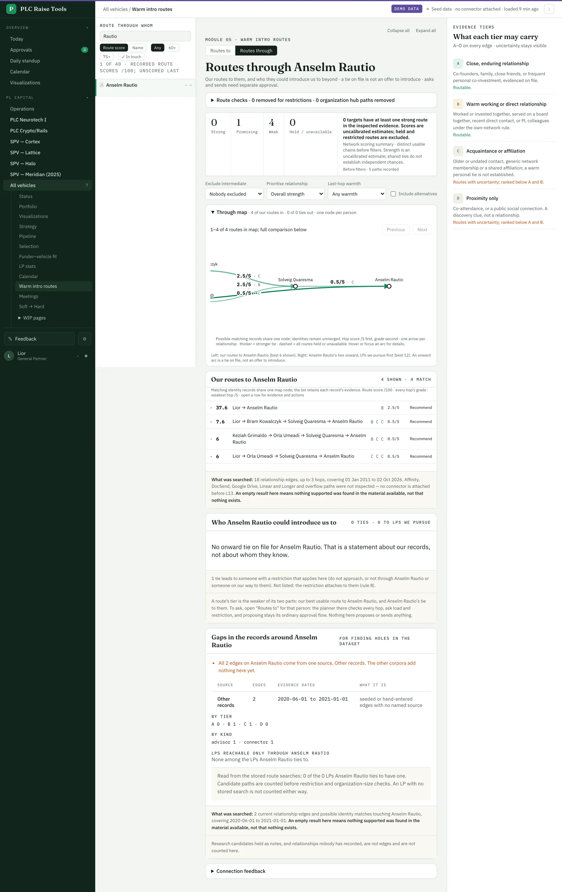
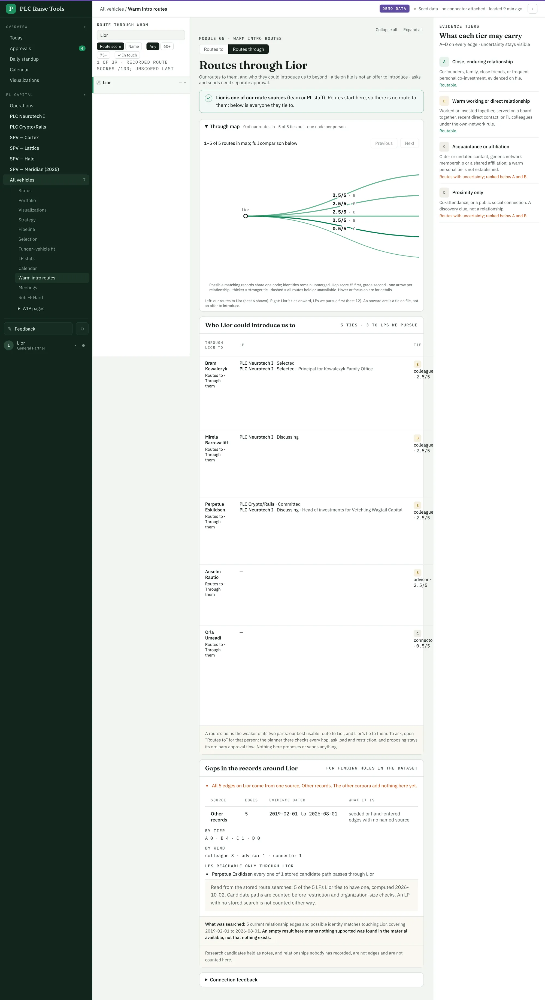

## Routes through — any node: our routes to it, whom it could introduce us to, and the gaps around it

Juan, 2 Oct 2026: "make another page like the 'warm intro routes to X' one, but this one should be 'warm
intro routes _through_ X' … this is another way of looking for connections, but also a way to debug, helps us
spot huge gaps in the dataset", and then: a toggle on the one page, in the address, so any state can be linked.

**The design: one page, a To / Through toggle.** The warm intro routes page has a **Routes to | Routes through**
switch above the heading. Through mode is `?mode=through` beside the usual `target=` and filters, so a link
reopens exactly that view, toggling keeps the node and the filters, and the browser's back and forward walk
between the two (the toggle is a link, not a replace). In through mode the picker reaches any node: our route
sources first (team, PL staff, the PL organization), then the pipeline, then anyone the search names.

What through mode shows for a node X:

1. **Our routes to X.** The same route checks, strength summary, filters and comparison list as Routes to, from
   the same cached search. When X is one of our route sources the page says so instead: routes start there.
2. **A map centred on X.** The ordinary route map, with our best routes in on the left, X in the middle and X's
   strongest onward ties on the right (LPs we pursue first). Someone already on our way to X is not drawn again
   as someone X introduces us to; the map says how many it left off, and the lists keep them all.
3. **Who X could introduce us to.** One row per person or organization X ties to: the LPs we pursue (vehicle and
   status, or "contact for" an LP organization), the strongest tie's kind, tier and warmth, its evidence with
   source and date, the sources behind it, and the combined route us → … → X → them. That route's tier is the
   weaker of our best usable route to X and X's tie (a node of ours adds no first hop). LPs rank first, then the
   combined tier. Each row links to Routes to and Routes through that person; asking stays in the Routes to
   planner, which checks every hop, the ask load and every restriction, and proposes through the existing
   approval flow. Nothing here proposes or sends.
4. **Gaps in the records around X.** X's edges counted by source (Affinity, research, W3 paths, warehouse,
   portfolio, the PL network rule, Dakota, possible identity matches, other records), with each source's
   evidence dates; by kind; by tier. Warnings when X has no edges, only tier D, edges from one source only, when
   X is a team member with fewer than 5 edges (a guess at "almost none"), when X is an LP we pursue with no
   usable route, and, through the PL organization, which route sources have almost no edges. Then **LPs
   reachable only through X**: read from the stored route searches, never recomputed, an LP whose every stored
   candidate path passes through X (or that has none, while the way through X is usable). Every count says what
   was searched and when (rule 7).

**Restrictions (rule 8).** A tie to someone with a do-not-approach instruction, a vehicle do-not-contact, or a
connector restriction naming X or anyone on our way to X is not listed or drawn; the page counts how many were
held back. A restriction on X itself means nothing is offered through X; its edges are still counted below.

*Demo data. Through Orla Umeadi: two routes in on the left, her two onward ties (both LPs we pursue) on the right;
three routes in that pass through Quaresma are left off the map and stay in the list. Every edge comes from one
source, which the gaps panel flags.*

*Demo data. Quaresma asked not to be introduced through Anselm Rautio, so through Rautio she is neither listed nor
drawn, and the card says one tie was held back. Through Umeadi she is listed, since her restriction names Rautio
only.*

*Demo data. Through Lior, a route source: no route to him, five ties onward, the three LPs first.*

**Speed.** Our routes to X are the planner's cached search, unchanged. The rest is indexed lookups on X's own
edges (evidence read for at most 2,000 of them, disclosed when cut), one pursuit query, the cached policy
topology for restrictions, and the stored route searches for at most 100 of X's LPs. No graph walk per
request. On the demo a through page renders in 70–130 ms.

**Links.** Routes through from the toggle on Routes to, from every person and organization page (beside a new
Routes to link), and from the LP page's warm intro box.

**Checks.** Properties: the two-hop tier is the weaker hop for all 16 pairs; a connector restriction removes its
target through that connector but not through another; a do-not-approach on Y removes Y and one on X offers
nothing through X; the gaps counts by source, kind, tier and date, and each warning, on invented edges; LPs rank
first. `npm run e2e` opens a through link directly, toggles to Routes to, goes back and forward, and toggles
back, checking the node and mode each time.

**For Juan to decide.** The thin-team threshold (5 edges) and the caps (2,000 edges, 100 stored searches) are
guesses. "Only through X" reads the stored searches, so an LP nobody has searched yet is not counted either way.
