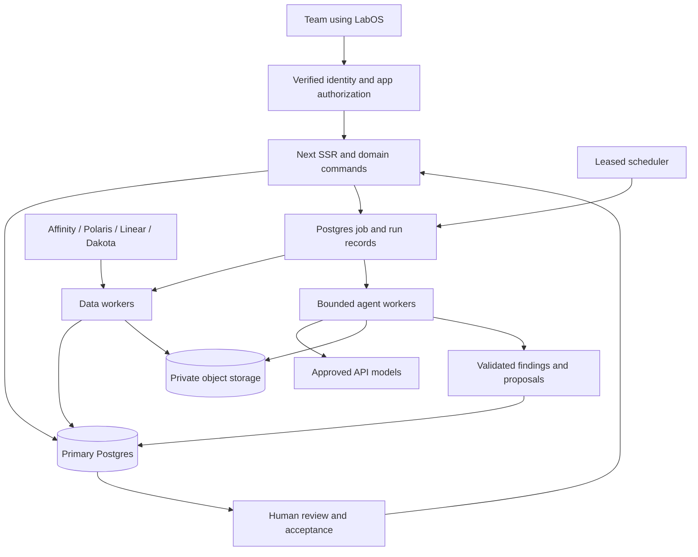

# Capital OS deployment, revision 2 — Astra

28 September 2026. Independent proposal for Juan's review; no deployment or code changes performed.

**The deployed service owns the live database, connectors, workflow execution, feedback and recovery.** Juan's Mac is a development client. Turning it off must not stop a sync, strand an import, prevent a team member changing a pipeline status, or prevent an operator restoring service.

This is a D-series deployment, not a second user interface over a Mac-operated system. Retain TypeScript, Next.js SSR, the modular monolith, Postgres, and the existing visual direction. Run several processes from the same repository and domain implementation; do not introduce a separate API service or rewrite the product around the starter scaffold.

Planning envelope: task = independent rev-2 plan; scope = this document only; evidence = tracked documentation and the local v1.13 kit; commands = offline reads, branch creation, document edits, diff checks and commit; budget/deadline = this planning session, handoff for tonight's review; output = the nine sections below; acceptance = an actionable service architecture, cutover, security model, workflows, costs, gates and sized build order; escalation owner = Juan, with Claude integrating. No real-data directories, secrets, network, provisioning or application tests were accessed for this plan.

Evidence is dated, not a claim of current platform capability. Sources: [rev-1 synthesis](../00-plan.md), sections [01](../01-deploy-secrets-repo.md), [02](../02-accounts-guardrails.md), [03](../03-feedback-devcycle.md), [04](../04-workflows-sync.md), [05](../05-testing-hardening.md), and [06 measurements](../06-measurements.md); [current synthesis](../../13-synthesis-r3.md), [domain rules](../../agent-rules/domain.md), [real-data rules](../../agent-rules/real-data.md), [Postgres](../../21-postgres.md), [backups](../../22-backups.md), [Affinity](../../15-affinity-integration.md), [Dakota](../../20-dakota.md), [Linear](../../24-linear.md), and W1/W3/W5 protocols. Kit references below are relative to `/Users/jbenet/git/plc-os/plcos-data/intake/ai-app-starter-kit-v1.13/`: `README.md`, `CLAUDE.md`, `AGENTS.md`, `pln-app.config.json`, `app/`, and all seven `.claude/skills/*/SKILL.md` files. No prices or services were checked online. **GUESS** marks proposed capacities, schedules, prices and performance targets; these require measurement or a PL quote.

## 1. Target architecture: processes, storage, jobs, connectors, agents

### Hosting decision

Ask PL for a dedicated Capital OS service allocation in its managed infrastructure, with LabOS as the entry point and identity provider. Prefer PL's existing cluster and managed Postgres over a new platform we operate. If the AI Apps deploy API cannot describe workers, restricted identities and migration jobs, PL should provision those through its normal infrastructure pipeline and register the web app in LabOS. That is a hosting integration task, not a reason to keep production on the Mac.

The kit provides a useful web deployment contract: source ZIP with Dockerfile, `$PORT`, `0.0.0.0`, `/health`, deep links, LabOS iframe embedding, secret injection, optional Postgres and CloudWatch logs (`deploy-to-labs`, `app-logs`, `db-migration`). It does **not** document a worker/scheduler platform, object storage, PITR, release rollback API, service-to-service identity, or CI credential. Its default 384 MiB/300m runtime and 2 GiB/1 CPU build are not our target allocation. More RAM alone does not supply those missing capabilities.

| Process | Responsibility and starting allocation, all allocation figures GUESS | Authority |
|---|---|---|
| Web | Two Next production replicas, each 1 vCPU / 2 GiB; SSR, user commands, review queue, job submission | Application reads and bounded domain commands; no vendor or model keys |
| Scheduler / dispatcher | One active scheduler with a database lease, restartable standby; 0.5 vCPU / 1 GiB | Enqueue only approved schedules and dispatch bounded jobs |
| Data worker | Two replicas, each 2 vCPU / 4 GiB; connector pulls, translations, imports, W3, network calculation | Source-specific permissions; shared domain command layer for canonical writes |
| Agent worker | Two replicas, each 2 vCPU / 4 GiB; initially four model runs total, maximum eight after measurement | Per-run tools and artifact writes only; no unrestricted SQL, shell or deployment |
| Migration / restore job | One ephemeral job, initially 2 vCPU / 4 GiB | Short-lived migrator or recovery role, never a web credential |

These are roles within one service and repository. Workers can use separate entry points and images with a common commit. The data worker's connector jobs get only the relevant secret when launched; a W3 calculation gets none. Agent processes never inherit connector credentials. No heavy import runs as a child of a web request.

Only W1's restricted public-research tools reach public sites. W5 has no web tool. W3 is deterministic and has no model cost. The model arrows represent a real external disclosure boundary even when the worker runs on PL infrastructure.

### Storage and ownership

Use managed **Postgres 17** as primary, subject to PL confirmation, with schema-per-module and the existing migration checksum ledger. Request 4 vCPU / 16 GiB and 100 GiB SSD to begin (GUESS). This is headroom for indexes, temporary imports, WAL and growing history, not an assertion that today's data needs 100 GiB. Rev 1 reports approximately 640 MB logical DB, 624 MB dump and 1.7 GB cluster including WAL; those are inherited observations, not measurements taken here.

Database grants separate research from confidential data; per-vehicle authorization remains in the command and query layers, not RLS. Require separately provisioned roles for schema ownership/migration, web runtime, import runtime, research reads, confidential strategy reads, job scheduling and backup. Runtime roles neither own tables nor create roles, disable audit enforcement or alter schemas. A single owner credential with a read-only pool setting is insufficient isolation. PL can create the roles; the app does not need `CREATEROLE`.

One primary does not mean one operating-system process: authenticated service processes can transact against that primary. This supersedes the local single-process writer rule for the deployed service only. Human and job writes share domain invariants and attribution. Research agents submit outputs through scoped tools; they do not receive a database password.

| State | Durable home and conversion |
|---|---|
| Pipeline, capital, consent, owners, restrictions, approvals, entity identities | Existing typed tables; authoritative app state |
| Affinity, Linear, warehouse observations | Source schemas plus immutable versioned inputs; source claims never silently become accepted capital or consent |
| Private init, mappings, readings, event tags and roster | Versioned DB configuration; migrate once, then edit through authorized commands; do not reload a Mac file at every boot |
| Findings, frozen batches, strategies, historical workflow files, materials | Private encrypted object store with DB manifest, hash, schema/version and classification; current accepted projections in DB |
| Feedback and attachments | DB owns IDs, reporter, triage and status; private object store owns attachments; no Mac journal dependency |
| Activity, audit, jobs and workflow ledger | DB records; audit append-only for runtime roles; preserve original run IDs and measured/estimated/unknown distinctions when importing JSONL |
| Dakota raw and translated state | Dedicated restricted DB schema initially; do not put licensed raw records into a general artifact bucket. Private object retention requires an explicit licence/storage decision |
| Temporary work directories | Encrypted ephemeral scratch, per job, deleted after completion; never the only copy |

Reserve 100 GiB for private artifacts and 300 GiB for backup retention (GUESS). Rev 1 reports 1.9 GB enrichment files, roughly 95 MB intake/materials/portfolio, 48 MB feedback and 50 MB Dakota replica. Do not migrate obsolete PGlite directories or duplicate old backups as application state. Object metadata must not expose names; private access requires the same authorization as the originating record. Hashes establish integrity, not permission.

Separate immutable run snapshots from replaceable connector caches. Keep manifests and accepted provenance for the life of the related record; propose 30-day raw cache and 90-day rejected-output retention (GUESS), subject to source terms and deletion obligations. An accepted output pins the exact input versions needed to explain it. Private evidence is not a CI artifact.

### Connectors owned by the service

| Connector | Credential and enforcement | Initial cadence and budget |
|---|---|---|
| Affinity | Dedicated read-only OAuth identity if available; otherwise approved credential confined to the existing GET/path-allowlisted connector; egress broker enforces methods as defence in depth | Incremental every 30 min; daily broader reconciliation; monthly deletion/merge sweep, all GUESS. Shared budget ceiling 80,000 requests/month, reserve 20,000 of the documented 100,000 cap; pause rather than exhaust it |
| Polaris / PL warehouse | Service identity with SELECT-only access to named datasets/views; workload federation preferred over Juan's ADC; query bytes capped | Nightly incremental graph inputs, weekly complete reconciliation, GUESS; initially 10 GiB maximum billed per query and 100 GiB/day total, GUESS; smaller queries first |
| Linear | Service identity scoped read-only if available; existing allowlisted GraphQL queries only, no mutations/subscriptions; PLC team filter enforced server-side | Every 15 min, GUESS; honour actual request and complexity headers, stop/back off at limits |
| Dakota | Service credential and existing list/count-only request builder; POST transport is necessary for reads, so HTTP-method filtering alone is wrong | Nightly changed-record pull, GUESS; global maximum one request/second, stop on 429, only needed fields; enable only after terms and PL residency confirmed |

The Affinity ceiling is an app allocation, not the whole account's entitlement: subtract other consumers and budget the sweep before launching it. At 48 polls/day, an illustrative 40 requests/poll is 57,600/month over 30 days (GUESS), leaving 22,400 within our allocation for sweeps and retries. Measure actual incremental cost; reduce cadence when it does not fit. The old Linear full pull was 44 requests / 12 seconds, and empty incremental 9 requests in docs/24; this predates PLC-only scope and is not a new benchmark. Ninety-six 9-request polls/day would be 864 requests/day, not 44 requests every poll. Dakota's recorded first pull was 312 requests; rate floor alone is about 5.2 minutes, excluding authentication, latency and retries.

Pull → validate complete manifest → translate transactionally → advance watermark. Pin source IDs, `source_updated_at`, mapping version and hashes. Missing fields preserve prior values, explicit nulls clear them, older versions cannot replace newer ones, deletions require a supported tombstone or complete reconciliation. Save both poll time and source time; show stale/failed status in the product. No user page waits on a vendor call.

Source systems remain authoritative for their own observed records; Capital OS is authoritative for team decisions. A human's status, amount, owner, restriction, note or override cannot be replaced by a connector's later timestamp. Keep source values and app overrides distinct, and surface discrepancies. Warehouse lineage can include Dakota: classification follows provenance through derived claims and joins, not merely a schema name.

## 2. Migration and cutover from today's Mac-hosted live

Rev 1's signed recurring bundles and nightly mirror create a permanent second operations site. Replace them with **one migration transfer**, then cloud-native execution. Do not expose the Mac's loopback Postgres to the internet or deploy an always-on tunnel.

1. **Prepare the target on invented data.** PL provisions roles, private storage, keys, backup and identity integration. Deploy staging web and workers, exercise the complete job path, and measure Linux production containers. Confirm confidentiality coverage for DB, object storage, snapshots, support operators, model providers and logs before moving private data. Dakota permission is separately required; PL warehouse precedent alone is not permission.
2. **Inventory the migration under the existing private boundary.** The migration operator records all tables, sequences, migration hashes, source checkpoints, file classes, pending jobs, user IDs, ownership links, feedback IDs and artifact counts. This plan contains no such records. Preserve surrogate IDs and historical actors. Map each active roster member to a verified LabOS UID; names are insufficient. Historical actors without a login remain attribution records.
3. **Rehearse in a restricted migration environment.** Use an encrypted backup and object manifest; keep it separate from staging and CI. Disable all scheduler dispatch, connector egress, model calls and inherited queued-job recovery. Restore with a one-time PL-managed job and explicit migration role. Transfer an encrypted consistent dump and files to a temporary private bucket via a short-lived upload credential; decrypt inside the private environment, not in build logs or images. Validate and delete transfer copies after the approved retention window.
4. **Prove equivalence.** Compare per-table counts and ordered checksums, sequences, constraints, migration ledger, artifact hashes and references. Check per-vehicle hard and soft totals independently, pending tickets/expiry, restrictions, ownership and consent evidence. Validate source snapshots against watermarks. Record intentional transformations such as the file ledger to DB conversion separately; no unexplained mismatch is acceptable. Ensure old queued or running jobs become historical/quarantined, never automatically dispatched.
5. **Schedule a short write freeze.** Target 30–60 minutes (GUESS), replaced by rehearsal time plus margin. Tell users when editing stops. Stop Mac writes, connectors, scripts and agents; finish or explicitly interrupt active jobs; freeze file writers as well as DB writers. Verify no authorized writer remains and record the final audit sequence, source cursors and time. Take the final consistent Postgres dump and matching artifact manifest. A pre-copy can reduce file transfer time, but every final hash is rechecked.
6. **Restore and validate the frozen state.** Load the empty production target, apply only reviewed additive migrations, map grants, run equivalence checks and authenticated user smoke flows. Run reads first. No bootstrap script invents pipeline, cash or consent state. Make DB and object recovery points before opening writes.
7. **Fence the old primary and switch.** Revoke Mac app write access and disable its launch/schedule entry points. Assign a production deployment epoch; only the cloud runtime identities for that epoch can write or claim jobs. Point users to the LabOS app. Open cloud writes, then resume approved connectors from migrated cursors with overlap/deduplication. Enable workflows in small waves, one type at a time. Onboarding includes a real pipeline edit under each person's own account and its audit receipt.
8. **Observe independently of the Mac.** A PL operator watches errors, auth failures, DB load, queue age, sync drift and conflict counts. After 48 hours (GUESS), confirm user acceptance and remove migration credentials. Keep the frozen Mac source encrypted for 14 days (GUESS), inaccessible to ordinary dev tools; then retire it per retention policy. It is historical recovery material, not a continuing live channel.

**Rollback has two different meanings.** Before cloud writes open, abort cutover and reopen the frozen Mac only after disabling the cloud writer and schedules. After cloud writes open, do not restore the old Mac copy and discard new work. Roll back application images against compatible cloud schema, or restore cloud PITR plus artifacts into a replacement primary with all writers fenced. If a return to the Mac is truly necessary, it requires a new freeze and a verified cloud-to-Mac transfer with explicit reconciliation of post-cutover writes. No bidirectional sync and no automatic failback.

**Backups are a cloud service obligation.** Request continuous PITR with RPO ≤5 minutes and measured RTO ≤60 minutes, plus daily encrypted logical exports, 14 daily / 8 weekly / 12 monthly copies and pre-bulk-change restore points (all targets/retention GUESS). Keep backups in a separately administered private bucket/account within the approved boundary, with keys recoverable by two named operators. Version objects and record a manifest for each backup boundary so DB references can be restored. Exercise a complete DB-and-object restore before launch and monthly thereafter. Daily dumps alone imply up to a day of lost team edits; rev 1's Mac mirror is not an acceptable recovery service.

## 3. Users, roles and guardrails

### Identity is a launch dependency

The kit's `pln-member-context` skill explicitly says **“Personalization only, not authentication”**. Server-side `/me` forwarding is documented, but a shared JavaScript-readable cookie can be replayed by sibling apps. Rev 1 acknowledges this and then treats `/me` as sufficient authentication; removing Developer pages does not protect the remaining capital and approval actions.

Require PL to support a verifiable, app-audience-scoped identity contract: preferably a signed short-lived assertion from its gateway with issuer, audience, subject, expiry and signature validation, protected against direct-origin/header injection. PL must strip client identity headers and prevent bypass of the gateway. Alternatively use PL-supported OIDC with a host-only, Secure, HttpOnly app session and server-side validation. This plan assumes PL can provide one of these; neither is promised by v1.13. Do not invent signing keys or undocumented endpoints. Until this is resolved, build and demonstrate on invented data; do not launch confidential writes using the personalization fallback.

Both production and staging are PRIVATE LabOS apps with a second explicit application roster. Bind immutable LabOS subject to existing `app_user.id`; no name matching, automatic directory-admin membership or default all-vehicle grants. Onboarding requires both access lists. Check active membership and capabilities on every command and protected query. Target offboarding/revocation effectiveness ≤60 seconds (GUESS); recheck immediately before consequential acceptance/approval. Missing identity fails closed for private reads as well as writes.

### Roles and attribution

| Role/capability | Allowed | Not implied |
|---|---|---|
| Viewer, explicit vehicle set | Authorized summaries and feedback | Restricted notes, money, downloads or edits |
| Operator, explicit vehicle set | Pipeline status, team context, ownership within scope, tags, request proposals/tickets, trigger bounded W1/W5 for accessible LPs | Approving money, granting access, unrestricted bulk imports |
| Approver, explicit ticket kinds and vehicle set | Decide bounded tickets and record authorized close events | Admin rights or approval outside scope |
| Data steward | Run/review imports, mappings, merge/re-point plans and source conflicts within assigned scope | User impersonation, sending, money approval or changing evidence rules |
| App administrator | Roster, schedules, quotas, configuration and emergency stop | Automatic business approval; grant that capability separately |
| Runtime identity | A named job type under an approved schedule or human work envelope | Interactive login, self-acceptance, unrestricted data access |

Juan initially holds admin plus approver capabilities; appoint a backup administrator and at least one independent approver before team launch. Access can be simple role × vehicle × field class at this scale, but cross-vehicle route results must not leak private notes or the existence of confidential amounts. Restricted fields include money, note/email/meeting bodies, health-redacted content, Dakota private fields, and restriction reasons. Enforce redaction in server loaders, exports, search and artifacts, not only components. A global restriction can safely block an action with a generic explanation when its reason is inaccessible. Overlap disclosure is itself permission-checked; route ranking must not become a way to infer hidden relationships.

**Pipeline status is a plan, separate from the six evidenced consent rungs.** A scoped operator can move an LP from Selected to Discussing directly in the live DB, with optimistic-concurrency check and audit, without a STAGE ticket. That edit does not imply opt-in, a meeting, commitment or cash. Consent reconciliation proposes evidenced rung changes via STAGE tickets. MONEY, SEND, INTRO_ASK and ALLOCATION_EXCEPTION remain bounded, approved and unexpired gates. Suggested policy: no self-approval for any of the five kinds; system-proposed STAGE can be approved by an authorized human. This tightens rev 1's STAGE exception and needs Juan's decision.

Every mutation records actual actor, initiating human or schedule owner, service executor where relevant, request/run ID, version, reason and outcome. A job must not pretend that its sponsor personally performed it. Use stable idempotency keys; acceptance and its domain effect/audit receipt commit atomically. Version checks protect notes as well as status and money: rev 1's last-writer-wins notes can silently destroy a colleague's text. Show a conflict and allow deliberate reconciliation. Undo is a new authorized command, never deletion of history.

Keep source sync, imports and workflow administration **in the service** behind steward/admin capabilities. Replace filesystem-centric Developer controls with an Operations surface showing freshness, queued/running/failed work, cost, dry-run diff and bounded retry/cancel. Compile out user switching, real reset/seed, arbitrary SQL/file execution and local Keychain helpers. Hiding a menu does not secure an exported server action.

Preserve all domain invariants: hard-only per-vehicle headlines; separate soft tracks; conserved capital calculations in deterministic code; dated follow-ups for colliding asks; target-wide restrictions; provenance and corpus/date disclosure; uncertain A–D ties with PL affiliation as strong evidence; invitation-only grants outreach; send-time Vehicle × Instrument scope. Do not restore the older human-confirmation gate on C/D information. Approvals stay on actions. No tool sends messages or accepts its own proposed task; accepting a SEND/INTRO_ASK ticket in this release records authorization for the human's action, not an enabled email/CRM writer.

At the web boundary: server authorization on every route/action, strict Origin/CSRF checks including sibling subdomains, input and upload limits, CSP permitting only intended framing, safe rendering, private response caching, and distributed per-actor limits. Initial GUESS limits: 60 mutations/minute, 20 feedback reports/hour, 100 objects/bulk command and 8 MiB total attachments/report. Rate state cannot live only in one replica's memory. Kill switches for human writes, connector schedules, imports and model dispatch are independently persisted and checked before mutation; authorized operators can apply them without deploying code.

The app roster cannot stop a PL database administrator, backup reader or cluster operator from seeing data. Require a written list of administrative groups, region, subprocessors, retention, support access procedure and audit trail. Break-glass access is time-bounded and recorded. No training on data applies to model accounts and any infrastructure/logging AI features. Disable generic prompt tracing and free-text analytics. Kit `app-analytics` sends paths/queries, titles and error text through separate telemetry and route-sync mechanisms; omit those defaults for production, or explicitly implement template-only routes, generic titles and fixed error codes. IDs alone are still potentially confidential identifiers.

## 4. Cloud workflows, job runner, agent execution and costs

### Runner decision

Use the existing Postgres job/run model as the durable queue, extended into a supervised **service job runner**. This is the narrowest migration of current imports and avoids shipping private workflow payloads into another SaaS control plane. A PL-managed scheduler wakes the dispatcher; Postgres owns due times, unique schedule-occurrence keys, attempts, leases, checkpoints and outcomes. No browser timer or web-process startup is responsible for keeping jobs alive.

Trigger.dev/Inngest Cloud are reasonable later alternatives if their payload/log retention and no-training boundaries are approved, but not prerequisites. Self-hosting a large orchestration platform adds another operating burden. Choose the Postgres runner now, with explicit limits: a bounded DAG of named stages and resumable batches, not a general workflow-language project. Existing child-process supervision is **not** already durable orchestration; the following semantics must be built and tested before using that description.

1. A user command or approved schedule creates the run envelope and queue receipt transactionally. The envelope pins task, scope, allowed evidence/tools, budget, deadline, output schema, acceptance criteria and escalation owner. Persist code SHA, protocol/hash, resolved model and settings, input snapshot hashes, configuration, classification and policy version. Record scheduled owner and actual executor separately.
2. Claim a ready job with `FOR UPDATE SKIP LOCKED`, issue a monotonically increasing lease/fencing token, and commit quickly. GUESS: heartbeat every 15 seconds, lease 90 seconds. No transaction stays open over a web or model call. A stale worker cannot commit after a newer lease exists; every checkpoint/result commit validates its fence. Locks on a firm/vehicle or source prevent overlapping incompatible jobs.
3. Work in small batches. Store an immutable output before its DB receipt; a crash can leave an orphan object that is safely collected later. A DB transaction atomically commits the applied batch, audit, checkpoint and next-stage enqueue/outbox entry. Consumers deduplicate by run/stage/input/version key. Never claim exactly-once external execution.
4. Retry transport errors for proven idempotent source reads/translation only, with bounded backoff and source limits; GUESS maximum three automatic attempts. A model timeout may already have incurred cost: record uncertainty and reserve another attempt explicitly. Identity merges, re-points, uncertain acceptance and ambiguous external effects go to operator review, not blanket replay. Retry has a new attempt ID under the same run; an intentional new execution gets a new run ID.
5. Cancellation is checked before every tool and commit; revoke its tool capability and stop later stages. On deploy, stop claims, drain bounded steps, then resume checkpoints using a compatible worker image. A pinned old protocol cannot silently execute under new semantics; retain its image or require an explicit new run. Failures show completed/failed/skipped/unknown counts, not a single optimistic green check.

### Workflow policy

| Workflow | Unattended scope at launch | Human boundary and output |
|---|---|---|
| Affinity / Linear / Polaris / permitted Dakota sync | Approved standing read-only schedules, after fixture and small live pilot | Scope expansion, remapping and large backfills are steward-triggered; publish source observations, never human-owned states |
| Deterministic translation, W3 connect, network build | After a complete pinned input batch; validate and publish a new version atomically | Name collisions and unresolved identity joins remain uncertain; identity merges require a reviewed plan |
| W1 research + W1c fact check | Bounded nightly queue of approved public identities after a quality pilot; initial waves human-triggered | New sourcing universes and quota increases need a new envelope; output findings with provenance, dates and coverage |
| W5 strategy + critic | Initially human-triggered per firm/vehicle; later scheduled refresh on approved scopes when inputs become stale | Always proposals; no pipeline/status, consent, money or outreach mutation; critic success is not human acceptance |
| W12 tags / W13 identity / W14 LP-unit reviews | Bounded proposal generation after their own pilot | Promotion, merge and re-point reviewed by an authorized human; no broad automatic identity consolidation |
| Findings import | Validated observational facts may project automatically under the run's approved scope | New pursuits, merges, strategy moves and consequential changes use preview → human acceptance → version recheck |
| Review queue, feedback triage | Validation and classification can run unattended | A classifier cannot grant access, change policy, accept its own proposal or execute a contradictory design request |

An end-to-end research wave is selection → immutable inputs → W1 → validation/fact check → W3 → W5 → critic → publish review queue. Keep a firm together so colleagues do not receive inconsistent asks. Stages can proceed for validated keys without waiting for an entire night's batch. Partial coverage and blocked dependencies remain visible. Sourcing first creates candidate proposals, not silently accepted live pursuits.

The cloud wrappers must preserve W1's public-only research queries and W5's no-web rule. Resolve protocol conflicts before the first cloud run: current W5 language about live rereads and C/D routes is older than the fixed-pass and updated domain rules. Freeze one input revision for a pass, then detect changed team context/restrictions/lead strategy at publication and acceptance. Stale proposals require regeneration or explicit reconciliation, never a mere timestamp refresh. This is a reviewed protocol change with protected regression examples, not permission for the agent to relax its own checks.

### Agent boundary

Use dedicated organization API projects with confirmed no-training controls and agreed retention, billing and data-residency terms. Do not run production workflows through Juan's interactive subscription, account cookie or desktop session. Assign the smallest model that passes the protected task cases: standard model for W1/tagging/critic, stronger model for W5 judgment, deterministic code for W3/math/validation. Pin exact model identifiers during implementation; no claim about current model pricing is made here.

W1 receives only its public identity projection and fetched public pages; a search broker rejects confidential fields and enforces shared site rate limits. No sign-ins, paid research sources or contact brokers are added. Protect against prompt injection and SSRF: deny private/metadata IPs, validate redirects and DNS destinations, cap response size/time, treat fetched text as evidence only. A webpage cannot enable a new tool.

W5 reads only the authorized confidential projection for its firm/vehicle, with health detail removed and classified Dakota private fields excluded. No arbitrary HTTP, SQL or filesystem tool. Input/output files in isolated scratch can ease migration of existing validators, but durable artifacts live in private storage. Child tasks inherit narrower permissions and budgets; the service controls tools, not instructions inside model text.

**A file path in a launcher prompt is not a privacy shield.** Once an API model reads the file or receives a tool result, those bytes have left PL. Document the approved confidential input classes for W5 and reviews, not just the no-training setting. Dakota-private data must not enter external model inputs, logs, caches or telemetry; an admin-only screen would not fix that. Public name research follows the existing narrow exception, with independent public provenance. If a strategy needs excluded information, present the missing context to an authorized human rather than smuggling a derived summary to the model.

Store model request IDs, timings, token/cache/reasoning usage and provider-reported costs per attempt. Content-bearing traces, if retained at all, are encrypted private evidence with scoped access, not stdout/Langfuse by default. Unknown usage stays unknown and consumes a conservative budget reservation. Reconcile billed usage; do not double-count cache tokens already included in input or reasoning included in output. Freeze new autonomy if measured correction burden exceeds the existing configurable 12 hours/week GUESS threshold; stop affected schedules and review, while keeping user edits and safe source reads available.

### Cost model: explicit assumptions, not a quote

All rates, workload and cache shares in this subsection are **GUESS** planning inputs. Standard tier: $3/million uncached input, $0.30/million cached input, $15/million output. Strong tier: $15 / $1.50 / $75 respectively. Assume 80% of input receives the cache-read rate, no separate cache-write surcharge in this simplified example; actual providers can differ. Replace with the organization's rate card and measured usage before approving a standing spend envelope.

| Daily work, GUESS | Calls × average input/output tokens | Tier | Estimated model cost/day |
|---|---|---|---:|
| W1 profiles | 100 × 30,000 / 4,000 | Standard | $8.52 |
| W1c checks | 100 × 12,000 / 1,000 | Standard | $2.51 |
| W5 strategies | 50 × 60,000 / 8,000 | Strong | $42.60 |
| Strategy critic | 50 × 20,000 / 2,000 | Standard | $2.34 |
| Total | 8.2M input + 1.0M output tokens | Mixed | **$55.97** |

Formula: `uncached_input_M × rate + cached_input_M × cache_rate + output_M × output_rate`. Add 20% for retries/repair: approximately $67/day. Reserve $5–20/day for an approved search API/tool service if one is authorized; otherwise use permitted public reads and do not silently purchase search. That gives $72–87/day or $2,160–2,610 per 30-day month at this workload. No-cache model cost would be $99.60/day before retries, approximately $120/day after them. These examples exclude W12, new sourcing rounds and extra revision loops; their budgets must be explicit additions.

Rev 1's roughly 226M-token night is a warning about context reuse, not an API bill. For sensitivity, if 226M total were 220M input with 90% cache hits and 6M output, the same hypothetical rates give about $215 on standard or $1,077 on strong, before tools and retries. The actual split/model is unknown. Do not migrate an unbounded interactive transcript loop and assume subscriptions cover it.

Proposed initial model budget: $150/day, $4,500/month aggregate, alert at 50%/80%, refuse new reservations at 100% (GUESS). Start with four concurrent calls, 30 tool calls/run, 20-minute W1 and 30-minute W5 deadlines, and maximum estimated $2/W1 or $5/W5 run (GUESS); reserve worst-case remaining usage atomically across all workers. Budget exhaustion pauses jobs and identifies their owner. Separate source API quotas from model dollars. GUESS infrastructure allowance is $1,000–2,500/month including database, workers, staging, storage, logging and networking; PL must quote the allocation. Base workload plus infrastructure is roughly **$3,160–5,110/month**, excluding staff and existing vendor licences. Maximum authorized envelopes can be higher than expected spend; neither is free because PL hosts it.

## 5. Dev cycle, channels, repo, CI/deploys and feedback triage

The Mac stays fast for code, demo data and optional authorized disposable previews. It is no longer a release controller, feedback courier or live database host. PL should provide an optional dev VM for continuity, not a requirement that Juan abandon local development.

| Channel | Code and data | Promotion |
|---|---|---|
| Local development / PR previews | Workstream branches; invented data; no production credentials | Rapid rebuilds; local may run ahead of integration |
| Staging | PRIVATE LabOS app, independent Postgres and buckets; invented volume/edge-case fixtures | Every gated integration candidate; same Linux images and config shape as production |
| Restricted rehearsal | Temporary restored real snapshot inside the approved PL boundary; no connector/model egress | Only authorized migration/performance diagnosis; no screenshots in git or CI uploads; delete on completion |
| Production | Single live primary; team identities; released image digests | Staging gate then controlled rollout; Juan can enable compatible feature flags for his own account |

No second local live writer. If Juan needs unreleased behavior on live data, use a tested production feature flag on the same schema and domain command version; do not point arbitrary local branches at production. Real bug reproduction defaults to invented regression fixtures, with restricted rehearsal only when necessary.

**Repository.** Keep the current private repository initially, verify its privacy and history before the first automatic push, then transfer to a PL-owned private repository if that improves ownership continuity. Claude remains integrator; builders use their own branches. Propose automatic branch pushes through a repository-scoped installation credential, short-lived if supported; protected `master` advances only after review and required checks. This is a proposed revision of today's “Juan pushes” rule, not authorization to push during this planning task. GitHub stores code, invented fixtures, plans and sanitized engineering work only. No real issue bodies, exports, database dumps, prompts or screenshots go there.

**CI.** Build in a clean Linux context from the pushed SHA and lockfile; no local data mount or traced private files. Run typecheck, boundaries, properties on PGlite and disposable Postgres, production build, trace/package audit, dependency/secret checks, authorization and workflow regression suites. Protect CI definitions and policy/eval files from agent-only approval. Fork/PR jobs receive no production credentials. Build web and worker images, record digests, migration inventory, protocol versions and flag defaults. Store releases in PL's registry. Promote the same tested image digests, not a fresh local build.

**Deploy.** Ask PL for an app-scoped service deployment identity, worker deployment support and retained-image rollback. Use a separate short-lived migration job with exclusive lock before rollout; web and worker startup check schema compatibility but do not hold schema-owner credentials. Use expand → backfill → switch → contract; keep current and previous images compatible until rollback window closes. Never edit applied migrations. Drain/pin old jobs during worker rollout. Test authenticated reads and one reversible synthetic command in staging, then production readiness and authorized non-destructive smoke tests.

The kit currently uses an approximately one-hour human deploy token and, for secrets apps, a draft requiring a LabOS Deploy click on code updates. It has no documented image promotion/rollback API. If PL cannot provide CI deploys immediately, retain that manual final click from a PL-hosted release controller using the exact CI-tested package; do not claim unattended rollback unless PL's infrastructure path actually supports it. This temporary deploy limitation does not move jobs or data back to the Mac. Target automatic staging and production release candidates throughout the day, with Juan/backup approving initial production promotions; after a stable pilot, let preauthorized low-risk fixes promote automatically behind flags. Authorization/security/schema-policy changes still receive review. Production lags only as long as its gates require, not two arbitrary daily trains.

**Feedback is native to the service.** The request transaction allocates its stable ID, validates reporter identity and writes the record; attachment completion is separately tracked. A cloud triage worker reads private reports under a bounded envelope. No public HMAC sync endpoint and no one-minute Mac pull. An issue can be Fixed in code, In staging or Live, determined from deployment receipts, not from a developer's completion message.

Retain four triage classes, with clearer acceptance boundaries:

- **A, small defect against agreed behavior:** prepare an implementation and regression test; integrator can merge under the standing policy. An agent never accepts its own proposal. A diff touching auth, connectors, migrations or financial meaning upgrades to review.
- **B, record correction:** attach the reporter's evidence and attribution; an authorized person applies the correction. A person's statement can be strong evidence without silently overwriting another source or a higher-scope decision.
- **C, conflict with Juan's design/rules:** cite the exact dated decision and send to his in-app review queue. Juan's explicit new instruction supersedes an old one; record that scope and date. Unverified or ambiguous text is not automatic authorization.
- **D, large change:** produce a concrete spec and acceptance criteria. Juan-directed work can be built behind flags; changed access, disclosure or outward authority needs explicit policy approval before activation.

Use a versioned decision log to guide triage; private decisions remain in the private store. The public repo gets only sanitized decisions. A private issue may be translated into an invented engineering reproduction with a private cross-reference; name matching/redaction alone cannot prove sanitization. No automatic GitHub/Linear issue export. In-app release notes and reporter updates suffice initially; external message tools remain disabled.

Proposed operational targets (GUESS): P0 alerts within 5 minutes to Juan and a named backup using an approved internal channel; triage acknowledgment within 30 minutes while covered; P1 within one business day and fix within one week; P2 within two business days/next slice; P3 weekly. P0 incidents freeze unsafe writes or dispatch immediately; recovery is not postponed to the ordinary bug-fix SLA. Cloud monitoring and operator access must work without an active desktop agent or deploy token.

## 6. Testing and launch gates

Rev 1 identified useful attack cases, but contradictory health expectations and optimistic capacity assumptions cannot be launch evidence. Section 06 measured a clean build's largest child at **1.80 GiB**, warm retry **1.84 GiB**, approximately **305 MiB** clean `.next` output, and a PGlite fixture import around **1.17 GiB**. Those are not Linux cgroup totals, web RSS or Postgres-worker RSS. HTTP runtime, PostgreSQL concurrency and a 384 MiB cap were blocked, not passed. The earlier 2.5 GB observation is not a universal build floor. Request headroom, then measure.

| Gate | Required evidence before private team launch |
|---|---|
| Platform contract | Working app-scoped identity, two private environments, multiple DB roles/schema grants, verified TLS, separate workers, private object storage, backup/restore and named operators. Kit personalization and one owner role do not pass |
| Authentication and authorization | Server-action/route/query inventory plus behavioral tests for every capability; revoked user, signed-out, forged header/token, sibling-origin CSRF, cross-vehicle IDs, stale approval, forbidden field/export and old user-switch endpoints all fail closed |
| Domain correctness | Both backend property suites; separate status/rung behavior; money conservation; source cannot overwrite human edits; restrictions across alternate connectors; bounded ticket expiry and self-approval; no duplicate acceptance; wrong-wrap and grant guards |
| Concurrent edits | Two users changing notes/status/money, retries after lost response, duplicate clicks, concurrent imports and human edits: one effect per key, explicit conflict, complete audit |
| Workflow recovery | Kill worker before/after artifact write and DB commit; lease expiry, scheduler duplication, DB outage, worker deploy, bad manifest, source 429, model timeout, cancellation and exhausted budget; no stale-fence commit, lost accepted output or unbounded replay |
| Agent quality and privacy | Protected W1/W3/W5 cases and failure-derived tests; source provenance, firm/vehicle consistency and staleness; prompt injection and tool abuse; Dakota and health canaries never reach model/search/log payloads; agent cannot edit its evaluator or enable tools |
| Capacity | Real production Linux images at requested limits; 10/20/30 simulated users for 30 min and 8-hour soak at 10 users while two imports and four agent calls run; GUESS p95 list <1.5 s, heavy page <4 s, foreground error rate zero under this planned load; RSS <80% limit, no OOM, bounded pools |
| Overload | GUESS 60 concurrent sessions, upload floods and slow source calls: controlled 429/503, bounded queue and recovery within 60 s; overload failures distinguished from accepted-write loss |
| Recovery and cutover | Measured full DB/object restore within 60 min and demonstrated ≤5 min DB RPO; exact migration comparison; old writer fenced; application rollback preserves new writes; no inherited job auto-execution |
| Packaging and telemetry | Clean build tree, final images/ZIP scanned and trace guard passed; no secrets/data; synthetic canaries absent from stdout, logs, analytics, route messages and CI artifacts; production refuses demo auth/reset |

Use `/health` for liveness, `/ready` for serving readiness: DB down or incompatible schema means readiness 503, not a falsely healthy app and not an endless liveness restart loop. Scheduler/worker heartbeat and queue-age alerts are separate. Connector failure degrades freshness, not the whole site's readiness. Health responses contain only safe deployment metadata; probes use the platform's internal access, not a broad public `/api/*` bypass.

Staging uses invented identities/data; do not rely solely on fake auth headers. Verify the actual LabOS gateway/iframe/identity flow with PL test members too. Load and adversarial agents target staging only with a checked environment identifier; no production attack or reset tool. Real-volume checks, if needed, run in the restricted rehearsal environment with controlled result reporting and no real screenshots.

Database connection budget (GUESS): two web pools ×8 =16, two data workers ×(2 batch +1 lock)=6, two agent workers ×2 metadata connections=4, scheduler=2, migration=2, monitors/backup=4: **34** steady connections. A full rolling overlap adds 28 web/data/agent connections, reaching **62**; request at least **100** effective connections with 20 reserved for recovery/administration. Explicitly cap job-child pools and replica autoscaling so this arithmetic stays true. Long calculations must not hold transactions across model/network waits. Measure query plans and lock waits before buying larger machines as a substitute for bounded work.

Launch first with Juan and a backup operator, then two team operators, then the remaining roughly ten users after a 48-hour pilot (GUESS). Gate private workflows by type after a small reviewed cohort; do not enable all schedules because the web app passed a smoke test. Production launch requires Juan's named ownership and the gates above; an overnight build can produce staging and tested components, but cannot truthfully prove an eight-hour soak, provider contracts and disaster recovery in a few hours.

## 7. PL Infra wishlist — numbers and priorities

This is ready to discuss with PL; it has not been sent. All requested resource quantities and service targets are GUESS planning allocations, to be adjusted after staging measurements. Larger PL resources are assumed obtainable; their exact provisioning interface is unresolved.

| Priority | Request | Reason / acceptance |
|---|---|---|
| **Must** | Production web: 2 × 1 vCPU / 2 GiB; data workers: 2 × 2 vCPU / 4 GiB; agent workers: 2 × 2 vCPU / 4 GiB; scheduler: 0.5 vCPU / 1 GiB | 10.5 vCPU / 21 GiB steady application envelope, plus rolling-deploy surge; independent worker lifecycle, no request timeout for jobs |
| **Must** | Postgres 17, 4 vCPU / 16 GiB, 100 GiB initial SSD, storage growth alert at 70%/85%, ≥100 connections | Private networking, module schemas, separate roles/grants, CA-backed hostname-verified TLS; no default owner credential in runtime |
| **Must** | One staging web 1 vCPU / 2 GiB and one worker 2 vCPU / 4 GiB, 2 vCPU / 8 GiB staging DB with 30 GiB disk; burst to production topology during gates | Independent keys, objects and DB; invented data; test replica races on full topology |
| **Must** | Linux builder 4 vCPU / 8 GiB, 30 GiB ephemeral disk, 2 concurrent builds; private image registry retaining at least 20 releases | Build measured near 1.84 GiB in one child; 2 GiB container budget is unproven; correct target architecture, no Mac-native prebuild assumption |
| **Must** | Private artifacts 100 GiB + separately administered backup storage 300 GiB, encryption and versioning; approved key recovery | DB/files restored together; no volume dependence; object endpoint available to authorized jobs only |
| **Must** | PITR 14 days, RPO ≤5 min, RTO ≤60 min; daily logical backup and monthly full restore drill | PL names who operates recovery and proves restore/failover; one-zone DB requires an explicit availability tradeoff |
| **Must** | App-audience LabOS identity, expiry/revocation ≤60 s, gateway bypass blocked, verified issuer/key rotation | Confidential write-capable product cannot use personalization as authorization |
| **Must** | Private workload identity, secret store and egress controls; static egress addresses if sources require them | Four source identities, two model projects, role-specific DB access; no Juan ADC or shared desktop keys as operations dependency |
| **Must** | Cloud health/queue monitoring, 30-day sanitized operational logs, restricted audit retention policy, two named on-call/recovery contacts | No reliance on one-hour deploy token to notice or recover an outage; document PL admins, region and no-training terms |
| **Must** | Read-only warehouse access to approved datasets; initial 10 GiB/query and 100 GiB/day guard; source/model quotas visible to operators | Prevent full warehouse scans and uncontrolled token spend |
| **Nice; required for unattended releases** | Scoped CI deploy identity, separate migrator job, digest promotion and retained-image rollback <5 min | If unavailable, manual final LabOS click remains; must not masquerade as autonomous rollback |
| **Nice** | Multi-zone DB with automatic failover, 4 vCPU / 16 GiB restricted dev VM, expiring 100 GiB rehearsal disk | Better availability and an alternative to Juan's laptop; VM receives no production writer credentials |
| **Nice** | Agent burst to 8 concurrent calls, worker cap 4 replicas, temporary 8 vCPU / 16 GiB bulk worker | Only after pool, provider quota, cost and quality gates; scale CPU-bound W3 separately from model calls |

Ask PL to price baseline and burst separately and name what it already provides versus what must be built. The kit needs documented worker/scheduler and object-store patterns; least-privilege DB roles; CA/TLS instructions; identity intended for authorization; CI/release history/rollback; configurable analytics; and administrative-access/backup documentation. Its “fixed defaults” and no-worker advice fit small sandbox apps, not this service. Preserve our UI; `pl-design-system` is not a prerequisite for LabOS's transport contract. Register only approved generic app metadata using `app-metadata`; no private fundraising figures in dashboard descriptions.

## 8. Decisions for Juan, with suggested answers

1. **Confirm service ownership and the operating boundary.** Suggested: PL production is the sole live primary and runs all four connectors plus data/enrichment/strategy workflows; the Mac has no required production role. Approve the corresponding D-series exceptions to local-only auth, workflow and storage rules in a later implementation change.
2. **Which PL boundary is “our system”?** Suggested: the named private cluster, DB, buckets, backup location and restricted operators, in a documented region. PRIVATE LabOS alone is insufficient. Require PL's administrative-access and no-training statement before private cutover.
3. **Dakota hosting and users?** Suggested: obtain explicit confirmation for hosted DB, backups, permitted members and any raw/object copies. Exclude Dakota-private fields from all external models. If permission is delayed, launch with a validated lineage-filtered dataset and disabled Dakota connector; do not assume deleting only its schema removes derived content. Either prove exclusion or delay that data's migration.
4. **What identity assurance is required?** Suggested: app-scoped verified LabOS identity is mandatory for confidential launch. PL supplies its contract; no shared-cookie personalization fallback for a writable primary.
5. **Who has access and who approves?** Suggested: explicit Operator/Viewer vehicle scopes, steward and approver capabilities separately; Juan plus a named backup admin; independent approver coverage per vehicle. No self-approval for the five ticket families. Ordinary pipeline changes stay immediate without STAGE tickets.
6. **What may API models read?** Suggested: W1 public projections; W5 approved confidential, health-redacted and Dakota-filtered projections under organization no-training agreements. Agree retention and regions as well as training. These are external model disclosures, even when launched from our server.
7. **How much unattended work?** Suggested: scheduled read-only sync and deterministic translation after pilots; W1 bounded standing batches after quality review; W5 initially human-triggered, always proposal-only. New universes, broad merges, policy edits and outbound execution never inherit approval from a schedule.
8. **Budget and infrastructure ask?** Suggested: approve the §7 request for quotation and the $150/day / $4,500/month model envelope, plus an initial $1,000–2,500/month infrastructure planning allowance. Confirm actual rates before enabling scheduled paid work; operator can stop spend independently of the app.
9. **Release authority and repo?** Suggested: private code repo, automatic branch pushes and CI, Claude integration, automatic staging; Juan/backup approves early production releases. Authorize gated low-risk promotion and automatic compatible-image rollback after the pilot. PL supplies a deploy identity; accept a temporary manual final click if necessary, not a Mac-hosted controller.
10. **Recovery commitment?** Suggested: ≤5-minute RPO, ≤60-minute RTO, two named recovery operators, separate backup authority and tested restore. Accept a 30–60-minute cutover window only after rehearsal; no stale-Mac failback after cloud writes.
11. **Team visibility and feedback?** Suggested: scoped access to money and notes, explicit decision on Affinity-derived sharing; private in-app feedback/attachments, cloud triage, invented engineering reproductions only in git. Disable default full-path/error-text analytics.

These decisions approve a concrete operating policy. This document does not itself provision resources, authorize data disclosures, change credentials or send PL a request.

## 9. Build order and sizes

Sizes are GUESS engineering effort: **S = 0.5–1 day, M = 1–3 days, L = 3–5 days**. “Tonight” means bounded implementation on invented data after plan review, not production readiness. Claude integrates; independent workstreams can proceed in parallel without changing shared policy mid-pass.

| Order | Deliverable and exit condition | Size | Dependency / timing |
|---|---|---|---|
| 1 | Record approved cloud rule changes and PL contract/ownership checklist; settle identity, Dakota and model disclosure decisions | S | Start tonight; PL/Juan answers gate activation |
| 2 | Clean Linux build/package path, cloud runtime without Keychain/ports/local fallback, liveness/readiness, trace guards, role-specific web/worker entry points | M | Tonight; uses fixtures and fake secrets only |
| 3 | Fix exposed action/header paths; capability/vehicle/field authorization, audit grants, idempotent commands, version checks, no self-approval, switcher/reset removal | L | Start tonight; foundational, not just hidden navigation |
| 4 | LabOS verified identity adapter, roster binding, revocation, CSRF and actual iframe/gateway tests | M | PL identity contract; can mock tonight, cannot sign off with mocks |
| 5 | DB/object stores for private config, feedback, artifacts and run history; hashes, classification, scope checks and upload completion | L | Fixture implementation tonight; storage policy and PL provisioning |
| 6 | Durable runner: leases/fences, scheduler keys, checkpoints, idempotent batches, cancellation, bounded retries, versioned workers and cost reservations | L | Orders 2/5; demonstrate recovery on invented jobs before real schedules |
| 7 | Cloud connector adapters and source-to-canonical ownership rules; service identities and freshness dashboard; migrate W3 | L | Orders 3/5/6; each source independently enabled; Dakota terms gate its data |
| 8 | W1/W1c and W5/critic API execution, restricted tools, versioned snapshots, output validators, model usage ledger and protected evals | L | Orders 3/5/6 plus provider policy; small reviewed cohort before unattended mode |
| 9 | Steward Operations surface: preview, conflicts, review/acceptance, cancel/retry and kill switches; remaining W12/W13/W14 proposal jobs | M | Orders 3/6/8; no arbitrary script runner |
| 10 | CI/release controller, migration job, image promotion/rollback, private feedback triage, sanitized work handoff and release receipts | M | Orders 2–5; CI identity or documented manual final-click path |
| 11 | Staging load/attack/quality gates, failure drills, DB/object restore, alerts and operator runbooks | L | Begin harness tonight; final evidence needs deployed topology and ≥8-hour soak |
| 12 | Restricted migration rehearsal, final cutover, authenticated pilot, connector/workflow enablement waves and Mac retirement | M | All preceding launch gates; two-person operations coverage |

Total estimated effort **23.5–46 engineer-days** using these ranges; with several independent builders and responsive PL support, aim for roughly **2–3 calendar weeks** including pilot and drills (GUESS, not a promised date). A staging web app and fixture-backed vertical slice can land much sooner. The critical path is identity/PL provisioning → authorization and storage → runner/connectors → rehearsal and recovery proof. Do not compress it by claiming a personal-cookie adapter or a child-process import is production-ready.

The first useful vertical slice is: a test LabOS user changes one fictional LP status → audited cloud command → scheduled fixture connector → W3 → one API-model strategy proposal → human acceptance → worker crash/retry → preserved result. It proves the service's whole operating model before broad migration. Success at launch is the same chain on authorized live records while Juan's Mac is turned off.
