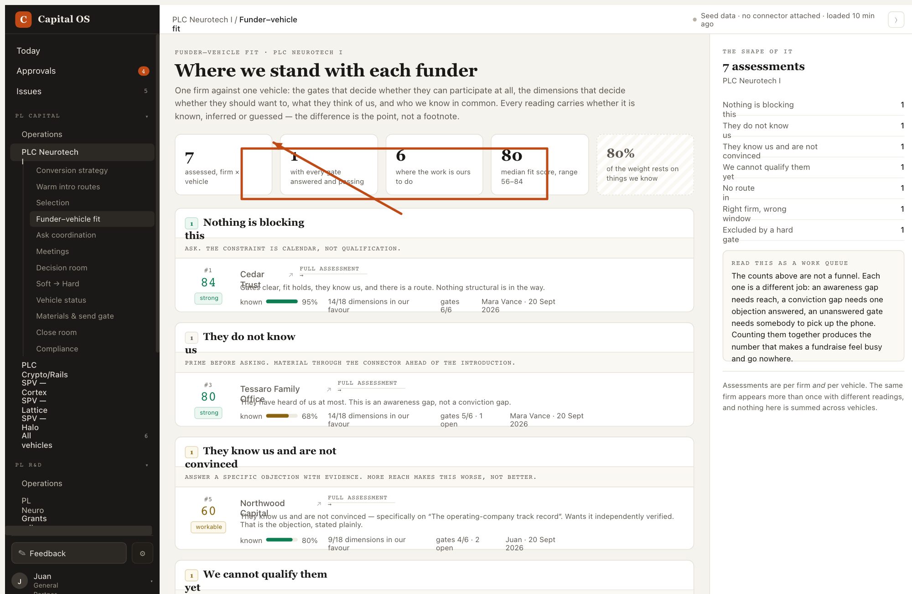

Northwood's median-and-range KPI tells me where the pool sits, and the score tells me where this firm sits in it, but nothing says which of the eighteen readings changed since the last assessment. When a score moves two points I want the diff, not the total. The arrow is on the KPI strip and the box is around the numbers that would need it.



```json context
{
  "route": "/neurotech/fit",
  "filters": {},
  "user": "juan"
}
```
