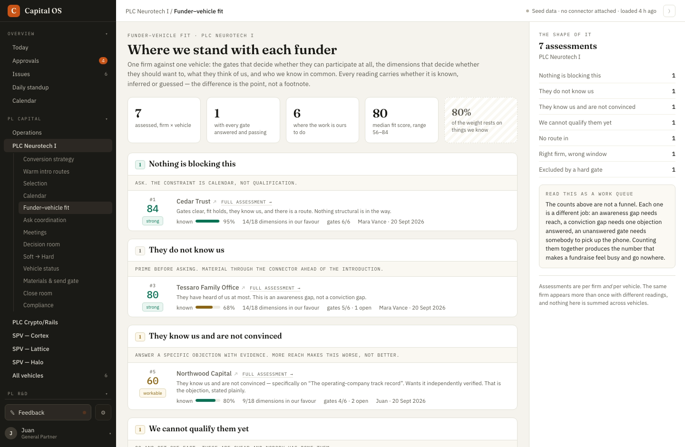

### What I tried

Dropped a PNG straight into the box. It should end up **beside the issue** and be referenced from the text, the way `GitHub` does it.

- write and preview share one renderer
- the source is what gets stored




```json context
{
  "route": "/neurotech/fit",
  "filters": {},
  "user": "juan"
}
```
