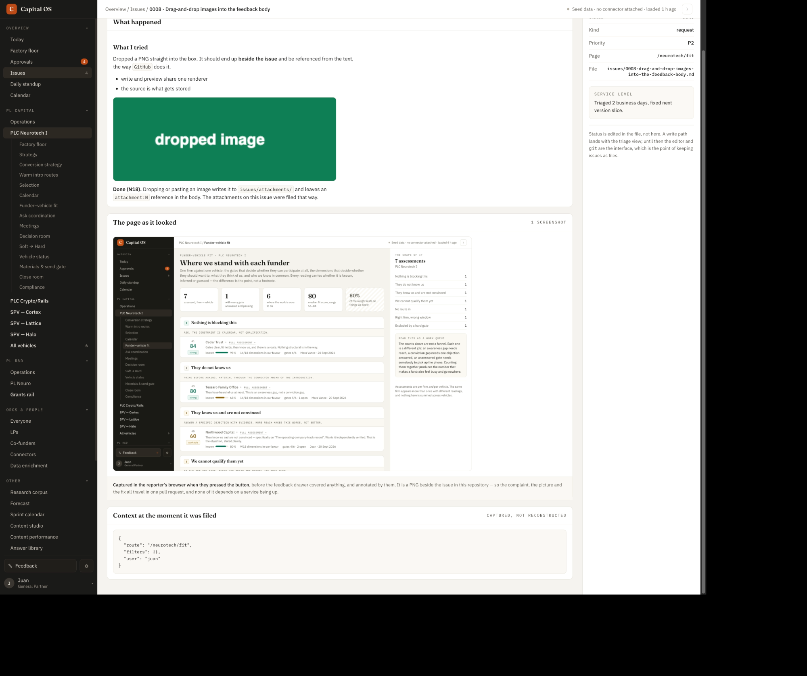

- The issues page is for development, so we should move it under \`Developer\`
- The page should maybe show history of fix (ie if it was fixed, the bottom should say which version / commit it was fixed in. 
- ofc, this will eventually leverage github, but my sense is the intake will still likely happen in the app itself (given the lack of user accounts, etc.) so maybe having some more info here helps.



```json context
{
  "route": "/issues/0008",
  "filters": {},
  "user": "juan"
}
```
