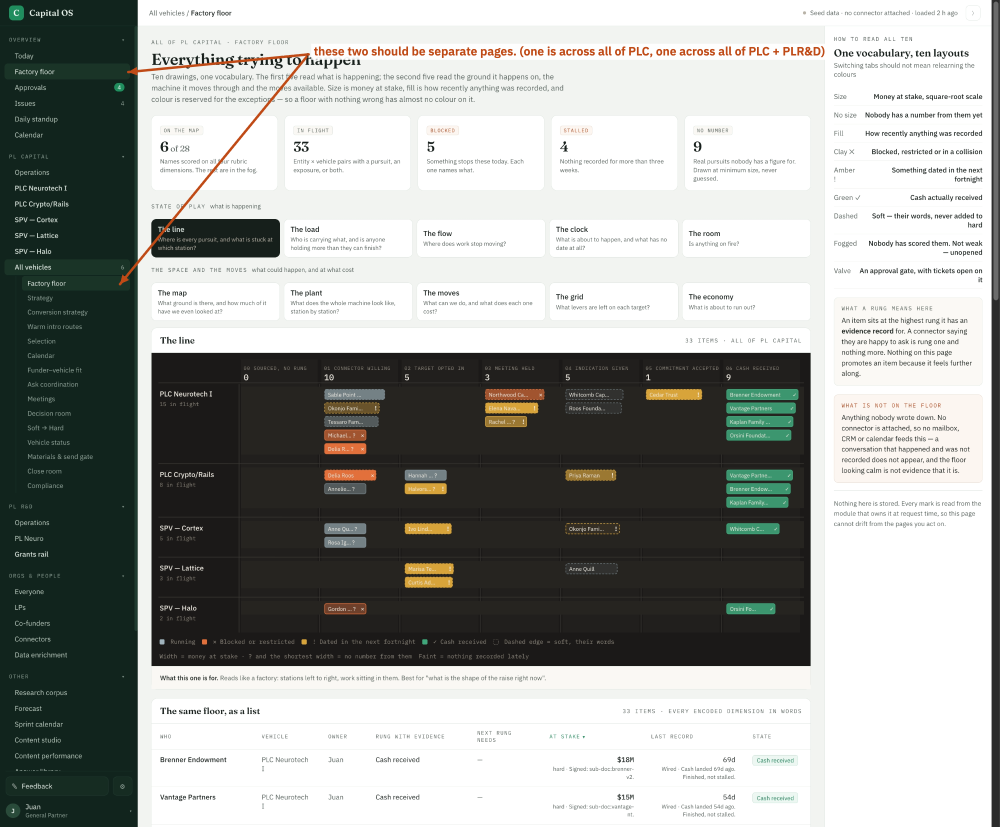

- These two should be separate pages (one is across all of PLC, and one is across all of PLC + PL R&D).
- Let's rename all these from "Factory Floor" to "Visualizations". and sink it to the bottom in the overview (below calendar)



```json context
{
  "route": "/all/floor",
  "filters": {},
  "user": "juan"
}
```
