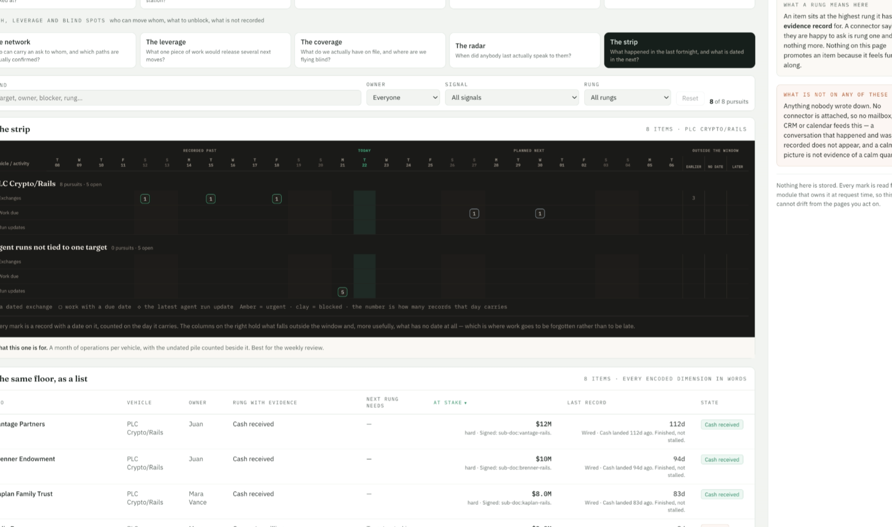

"Pick a part" screencap is off from where i intended to capture it. seems like an x alignment issue.



```json context
{
  "route": "/rails/visualizations",
  "filters": {},
  "user": "juan"
}
```

**Done (N35).** It was the arithmetic, and it was off in y too — x just shows it more.

The screen capture shrank the frame to 2000px wide *first*, then cropped it using
`devicePixelRatio` as though nothing had been shrunk. On a 2× screen that put the rectangle
44% further right and further down than the one you drew, and made it bigger — which is the
picture in this issue. The crop now happens on the full-resolution frame, and the scale is
measured (frame pixels ÷ viewport pixels, per axis) rather than assumed.

Measured with a red box dragged corner to corner at 2×: the old code captured a rectangle
with **0%** of the box in it, the new one **100%**. If you share a window or a whole screen
instead of the tab, the frame is the wrong shape for viewport coordinates, so the part is drawn
from the page instead and the thumbnail says so.
