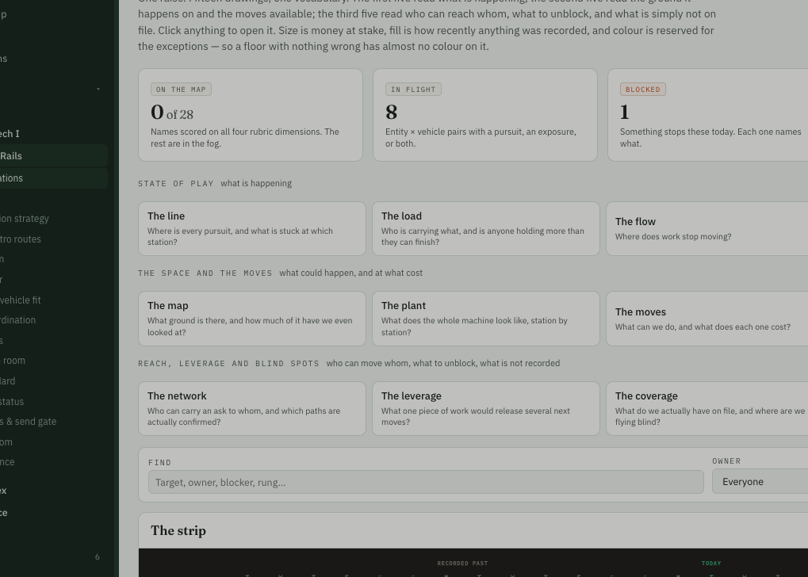

These section titles ("state of play" etc) are hard to see (in this and other pages). maybe the CSS for these should make them more visible?



```json context
{
  "route": "/rails/visualizations",
  "filters": {},
  "user": "juan"
}
```

**Done (N36).** Two changes, because these were doing two jobs.

- **The three tab groups are headings now** — *State of play*, *The space and the moves*,
  *Reach, leverage and blind spots* — in the display face, with a rule above each.
- **Every small uppercase label is one step darker and one step heavier**, everywhere: a new
  `--label` colour between ink and muted, weight 500, half a point larger. They passed the
  contrast ratio before and were still hard to see, because small caps in a light weight with
  wide tracking read as texture rather than as words. Both themes have their own shade.
