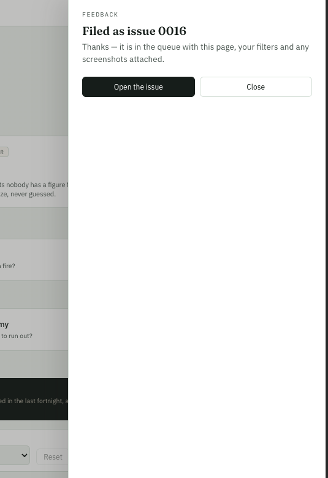

Feedback screen should let me give more feedback. one of the buttons should be "Give more feedback"



```json context
{
  "route": "/rails/visualizations",
  "filters": {},
  "user": "juan"
}
```

**Done (N35).** The confirmation leads with **Give more feedback**, and `⌘↵` does the same
thing there — so the rhythm is type, `⌘↵`, `⌘↵`, type. It clears the words, the pictures, the
kind and the priority, and takes a fresh screenshot, because the last one belongs to the issue
it was filed with. Everything filed while the box has been open is listed under the buttons.
