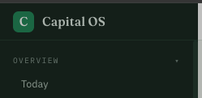

Can you change the name of the tool to "PLC Raise Tools" (instead of Capital OS) everywhere? for now. we may return to Capital OS later on



```json context
{
  "route": "/issues",
  "filters": {},
  "user": "juan"
}
```

**Done (N36).** **PLC Raise Tools** on every screen: the rail, the browser tab, the R&D
page, the published build log, and the label on anything handed to Linear.

It is one constant — `config/deployment.ts` → `product` — so going back to Capital OS is one
block. *Capital OS* stays as the codename in the code, the docs and the design history, and in
the storage keys and cookie names, which can't be renamed without signing everybody out and
resetting their theme and layout.
