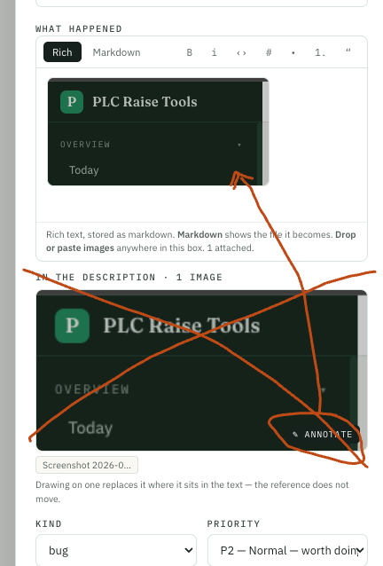
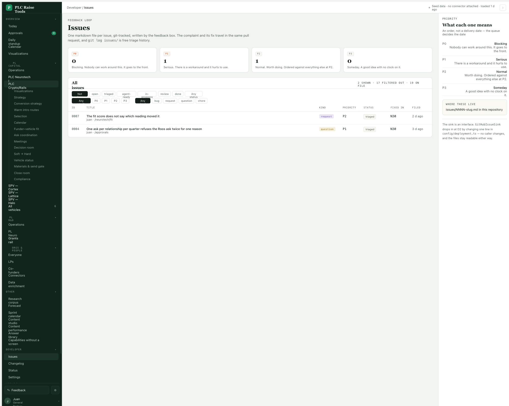

- annotating screenshots embedded in feedback text should happen from the embed. remove the extra section and listing of images.
- (deleting an image from the text didnt remove it from that listing -- deleting an image from the text should not submit it anymore. a user may not want the image to be sent anymore -- for ex: imagine they drag-and-dropped the wrong picture!)
- should be able to expand the feedback dialog to more of the page (in case it gets very full).





```json context
{
  "route": "/issues",
  "filters": {},
  "user": "juan"
}
```

**Done (N37).** All three.

- **Annotate from the picture.** Every picture in the description has **✎ Annotate** and **×**
  on its own corner, and an *annotated* mark once it has been drawn on. The separate strip and
  its second copy of every image are gone.
- **Deleting a picture from the text means it is not sent.** Only pictures the text still
  refers to go up, in the order the text refers to them, with the references renumbered to
  match. This issue is itself the evidence: `0020-image-1.png` is attached and nothing in the
  text points at it — the wrong picture, deleted, and filed anyway.
- **⇤ Wider** in the corner of the box takes it to most of the page — the words on the left,
  the context and screenshots on the right, a taller editor — and the choice is remembered in
  this browser.

Two identical pictures dropped twice used to be indistinguishable to the editor, so annotating
the second could have changed the first; each picture now carries its own number through the
editor, and the second one is the one that changes.
