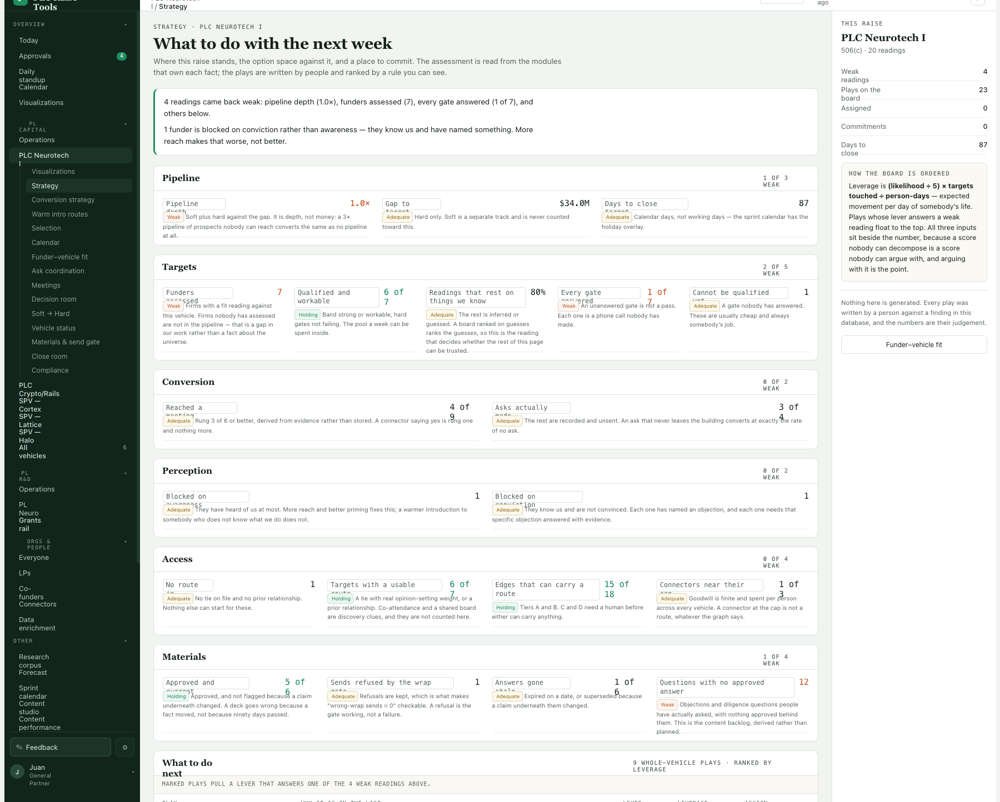

The repo got a bit big (>100MB) and it seems to be the changelog screenshots.

- wonder if we can compress them to reduce space? (use a jpg or png compressor), or reduce the resolution?
- after changing the workflow, write it into a tool or document how to do it for other agents working on the codebase (in case it isn't already documented)
- then maybe purge the older big images from the git history? (may need to rewrite git history)

Thanks!



```json context
{
  "route": "/neurotech/strategy",
  "filters": {},
  "user": "juan"
}
```

**Done (N40), except rewriting the history, which waits for a yes.**

- **Smaller.** Every changelog screenshot is a 2000 px WebP at quality 80 now: 194 files,
  119 MB → 26 MB, and indistinguishable from the PNGs at reading size. The 191 links in
  CHANGELOG.md point at the new names.
- **Written into the tools, not just the docs.** `npm run shots` writes WebP directly and
  prints each file's size. `npm run shots:compress` converts anything that arrives as a PNG
  and fixes its links. `npm run boundaries` fails on a PNG in the folder, or on a file over
  512 KB. CLAUDE.md, *Working notes*, says all of this for the next agent.
- **The history.** Not rewritten yet. The old PNGs are 131 MB of the 138 MB in `.git`, so
  until they go, converting makes the repository about 26 MB *bigger*, not smaller. Dropping
  them from every commit would take `.git` from about 141 MB to about 33 MB. N37 and
  everything before it are already on GitHub, though, so it means a force-push, and every
  commit gets a new hash. Old commits would keep their changelog but lose its pictures.

Also fixed: the `>` in this issue's title arrived as `&gt;`. The editor was writing `<`, `>`
and `&` as HTML entities, and that reached the body and, through it, the title. Fixed in
the feedback box, and in this file.

**History rewritten, 23 Sep (Juan: "yes, re-write the git history").** Every
`docs/changelog/shots/**/*.png` is gone from every commit; nothing else changed. Checked commit by
commit: the same 72 commits, with the same messages, authors and dates, and each tree identical to
the old one apart from those PNGs. The issue screenshots in `issues/attachments/` are current files
and stay. The pack went from 162 MB to 34 MB.

- **To publish it:** `git push --force origin master`. GitHub still has the old history up to N37
  until then, and every commit hash has changed, so any other clone needs a fresh clone.
- **A backup** of the old history is at `.git/pre-purge-2026-09-23.bundle` (173 MB). Delete it once
  the push is done; until then `.git` still looks big.
- The local `origin/master` tracking ref was dropped, since it pointed into the old history. The
  push puts it back.

